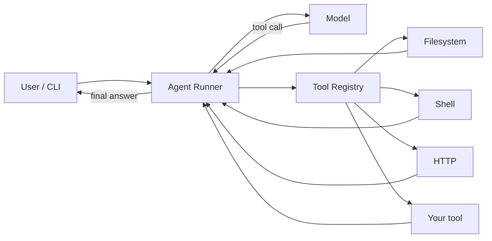

<div align="center">

```
 ____  ____   ___  __  __  _____ _____ _   _ _____ _   _ ____
|  _ \|  _ \ / _ \|  \/  || ____|_   _| | | | ____| | | / ___|
| |_) | |_) | | | | |\/| ||  _|   | | | |_| |  _| | | | \___ \
|  __/|  _ <| |_| | |  | || |___  | | |  _  | |___| |_| |___) |
|_|   |_| \_\\___/|_|  |_||_____| |_| |_| |_|_____|\___/|____/
```

# Prometheus

### Python Agent Runner + Tools

**Give an agent a loop. Give the loop tools. Let it steal the fire.**

[](https://www.python.org/)
[](https://python-poetry.org/)
[](LICENSE)

</div>

---

Prometheus is a **Python agent runner**: a tight execution loop that calls a model, dispatches tools, and feeds results back until the job is done.

No framework maze. No hidden magic. One runner. Pluggable tools.

```text
  you ──► runner ──► model
              ▲         │
              │         ▼
              └── tools ◄┘
```

## Why Prometheus

| | |
| --- | --- |
| **Runner-first** | The loop is the product. Everything else plugs into it. |
| **Tools as contracts** | Register a function, get a schema, run it. |
| **Poetry-native** | Reproducible installs, locked deps, one command to start. |
| **Small surface** | Read the source in an afternoon. Extend it in an evening. |

## Quick start

```bash
# Clone
git clone git@github.com:FedericoGabrielCastro/Prometheus.git
cd Prometheus

# Install (Python 3.12+)
poetry install

# Run tests
poetry run pytest
```

## The loop

Plug in any model that implements `complete(messages) -> AssistantReply`. The runner does the rest.

```python
from prometheus import AgentRunner, AssistantReply

class Echo:
    def complete(self, messages):
        last = messages[-1].content
        return AssistantReply(content=f"heard: {last}")

result = AgentRunner(Echo(), system_prompt="keep it short").run("steal the fire")

print(result.output)        # heard: steal the fire
print(result.stop_reason)   # completed
print(len(result.turns))    # 1
```

Stop conditions:

| Reason | When |
| --- | --- |
| `completed` | The model replies with no tool calls |
| `max_turns` | The loop hits the turn budget (default 16) |

If the model asks for a tool, the runner executes it (or records an error) and feeds the result back as a `tool` message. Tool exceptions never kill the loop.

## Tools

Register a function. Prometheus builds the JSON schema from type hints, `Annotated` metadata, and the docstring.

```python
from prometheus import AgentRunner, ToolRegistry, tool

@tool
def spark(n: int = 1) -> str:
    """Make n sparks."""
    return "ember" * n

tools = ToolRegistry([spark])
result = AgentRunner(your_model, tools=tools).run("ignite")
```

The runner passes `tools.schemas()` into every `model.complete(...)` call so the model can see what it is allowed to use. Unknown names, missing arguments, and extra arguments come back as `error:` tool messages — they do not crash the loop.

Built-in tools (filesystem, shell, HTTP) are next.

## Architecture



The runner owns the loop. Tools never talk to the model. The model never touches the filesystem. That boundary is the whole design.

## Project layout

```text
Prometheus/
├── src/prometheus/
│   ├── runner.py       # Agent loop, turn state, stop conditions
│   ├── tools.py        # @tool, registry, JSON schemas
│   ├── schema.py       # Type hints → JSON Schema
│   ├── model.py        # Model protocol
│   └── types.py        # Messages, turns, stop reasons
├── tests/
├── pyproject.toml
└── README.md
```

## Roadmap

Built as a sequence of small, reviewable PRs:

- [x] **0 — Bootstrap** — Poetry project, layout, tests, this README
- [x] **1 — Runner** — Agent loop, turn state, stop conditions
- [x] **2 — Tools** — Tool protocol, registry, schema generation
- [ ] **3 — Built-ins** — First-party tools the runner can actually use
- [ ] **4 — CLI** — `prometheus run` from the terminal

## Requirements

- Python **3.12+**
- [Poetry](https://python-poetry.org/docs/#installation)

## License

MIT. See [LICENSE](LICENSE).

<div align="center">

**Steal the fire. Keep the loop honest.**

</div>
