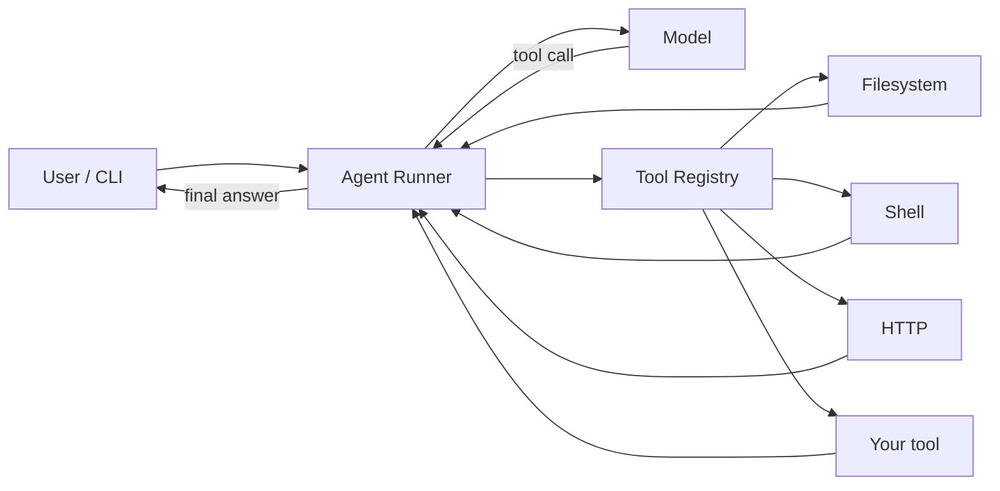

<div align="center">

```
 ____  ____   ___  __  __  _____ _____ _   _ _____ _   _ ____
|  _ \|  _ \ / _ \|  \/  || ____|_   _| | | | ____| | | / ___|
| |_) | |_) | | | | |\/| ||  _|   | | | |_| |  _| | | | \___ \
|  __/|  _ <| |_| | |  | || |___  | | |  _  | |___| |_| |___) |
|_|   |_| \_\\___/|_|  |_||_____| |_| |_| |_|_____|\___/|____/
```

# Prometheus

### Python Agent Runner + Tools

**Give an agent a loop. Give the loop tools. Let it steal the fire.**

[](https://www.python.org/)
[](https://python-poetry.org/)
[](LICENSE)

</div>

---

Prometheus is a **Python agent runner**: a tight execution loop that calls a model, dispatches tools, and feeds results back until the job is done.

No framework maze. No hidden magic. One runner. Pluggable tools.

```text
  you ──► runner ──► model
              ▲         │
              │         ▼
              └── tools ◄┘
```

## Why Prometheus

| | |
| --- | --- |
| **Runner-first** | The loop is the product. Everything else plugs into it. |
| **Tools as contracts** | Register a function, get a schema, run it. |
| **Poetry-native** | Reproducible installs, locked deps, one command to start. |
| **Small surface** | Read the source in an afternoon. Extend it in an evening. |

## Quick start

```bash
# Clone
git clone git@github.com:FedericoGabrielCastro/Prometheus.git
cd Prometheus

# Install (Python 3.12+)
poetry install

# Run tests
poetry run pytest
```

## Architecture



The runner owns the loop. Tools never talk to the model. The model never touches the filesystem. That boundary is the whole design.

## Project layout

```text
Prometheus/
├── src/prometheus/     # Agent runner + tools
├── tests/              # Pytest suite
├── pyproject.toml      # Poetry project
└── README.md
```

## Roadmap

Built as a sequence of small, reviewable PRs:

- [x] **0 — Bootstrap** — Poetry project, layout, tests, this README
- [ ] **1 — Runner** — Agent loop, turn state, stop conditions
- [ ] **2 — Tools** — Tool protocol, registry, schema generation
- [ ] **3 — Built-ins** — First-party tools the runner can actually use
- [ ] **4 — CLI** — `prometheus run` from the terminal

## Requirements

- Python **3.12+**
- [Poetry](https://python-poetry.org/docs/#installation)

## License

MIT. See [LICENSE](LICENSE).

<div align="center">

**Steal the fire. Keep the loop honest.**

</div>
